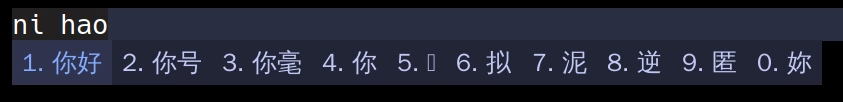

# Tokyonight
使用Tokyonight 配色的fcitx5主题

## 截图
Tokyonight-Storm主题

Tokyonight-Day主题

## 安装

clone 项目, 将Tokyonight-Day 和 Tokyonight-Storm两个目录复制到fcitx5的主题目录中,在Arch linux下,该目录默认为`~/.local/share/fcitx5/themes`,打开fcitx5 configuration选用该主题即可

## Other

觉得好看麻烦给个star哦! (◍•ᴗ•◍)

## License
MIT License

Copyright (c) 2022 ch4xer

